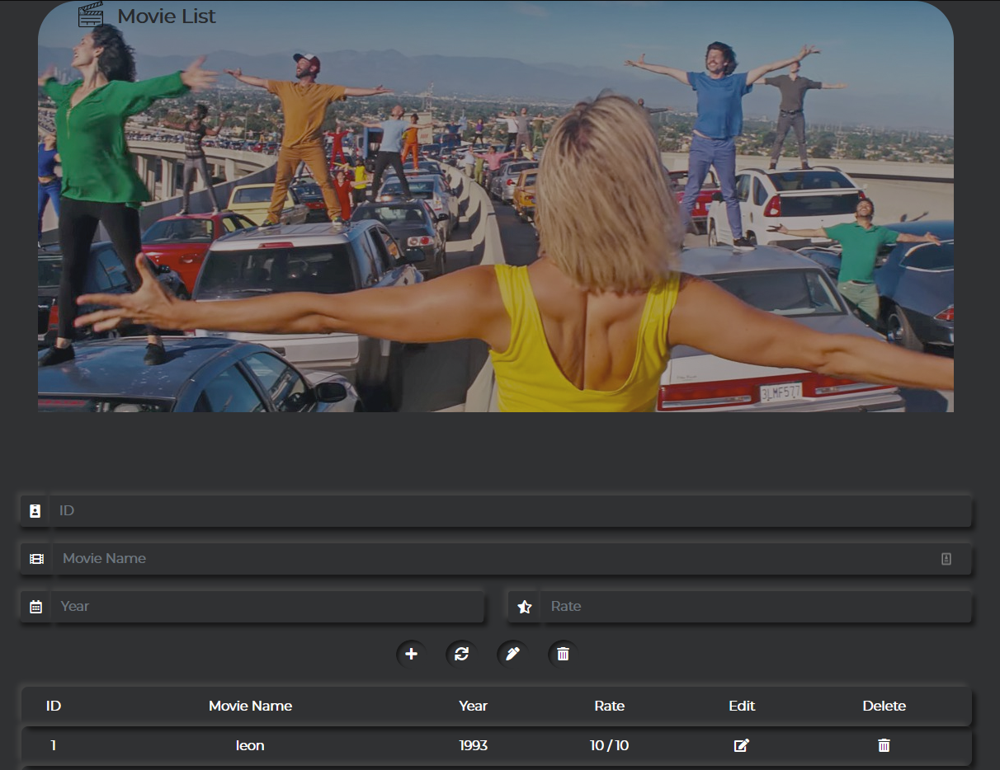

# movie-list

The application is created by using PHP, CSS and SQL. Applied CRUD operation. User can simply add, display, edit, and delete their watched or favorite movies by using Movie List application.

## Application display

 

